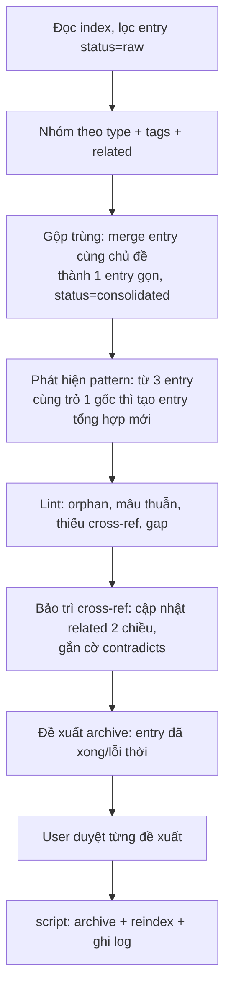

# Quy trình consolidate

Chạy thủ công. Dừng ở tầng tri thức, không tự thực thi. Output: entry `consolidated` sạch, danh sách pattern, báo cáo lint.

## Luồng 9 bước

## Lint (health-check kho, chỉ đề xuất, không tự sửa)

- **Orphan**: entry không ai link tới và cũng không link ra. Gợi ý gắn cross-ref hoặc archive.
- **Mâu thuẫn**: 2 entry nói ngược nhau. Gắn `contradicts`, hỏi user chọn cái đúng.
- **Thiếu cross-ref**: 2 entry cùng tag/chủ đề nhưng chưa link. Đề xuất nối.
- **Gap**: khái niệm nhắc nhiều nhưng chưa có entry riêng. Đề xuất câu hỏi/entry cần tạo.

## Gộp trùng

Merge entry cùng chủ đề thành 1 entry gọn, đặt `status: consolidated`. Entry gốc KHÔNG xóa thẳng, chuyển sang `archive/` qua `archive.py` để giữ vết.

## Phát hiện pattern

Từ 3 entry trở lên cùng trỏ về 1 gốc, tạo entry tổng hợp mới đứng trên chúng.

## Bảo trì cross-ref 2 chiều

Link A đến B luôn kèm B đến A. Khi sửa `related`, cập nhật cả 2 phía. Link là công dân hạng nhất.

## Chốt an toàn

Mọi thay đổi cấu trúc (merge, archive, sửa cross-ref) phải được user duyệt trước. Script chỉ chạy sau khi duyệt:
- `archive.py <id>` để chuyển entry và reindex.
- `reindex.py` sau khi sửa frontmatter tay.
- `log.py consolidate "<tóm tắt>"` ghi lại thao tác.
