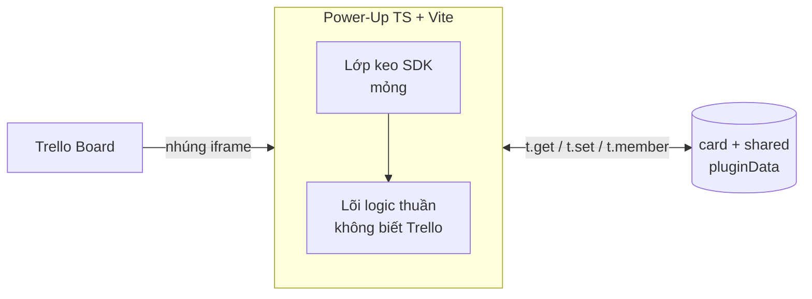

# 🎯 Trello Point System

**Power-Up tự host cho Trello: estimate, log point và xem lịch sử ngay trên từng thẻ.**


Trello Point System biến mỗi thẻ Trello thành một sổ ghi point kiểu "log time". Mỗi lần ghi rõ **ai**, **bao nhiêu point**, **ngày nào** và **ghi chú**. Toàn bộ dữ liệu nằm trong chính thẻ Trello, không cần backend, không cần API key lúc chạy.

Đơn vị là **point**, không phải giờ. Phù hợp cho nhóm muốn theo dõi công sức bỏ ra trên từng đầu việc mà không rời khỏi Trello.

## Tính năng

- **Estimate per-card.** Đặt một con số mục tiêu chung cho mỗi thẻ. Tùy chọn, ai trong board cũng sửa được.
- **Log point per-member.** Mỗi người ghi point của riêng mình. Tự nhận diện qua tài khoản Trello, không nhập tay tên.
- **Lịch sử theo ngày.** Gộp log của cả nhóm, nhóm theo ngày, có tổng phụ mỗi ngày, ngày mới nhất lên đầu.
- **Badge trên thẻ.** Hiện `🎯 đã_log/estimate` ngay mặt thẻ. Tô cam khi log vượt estimate.
- **Dashboard cấp board.** Nút **Point Stats** trên thanh board mở thống kê point theo list và theo user.
- **Không va chạm.** Mỗi người chỉ ghi key của chính mình, hai người log cùng lúc không đè nhau.
- **Quyền rõ ràng.** Chỉ chủ nhân sửa/xóa log của mình. Xóa có xác nhận một bước nhẹ tại chỗ.
- **Cảnh báo dung lượng.** Thanh % cho biết thẻ đã dùng bao nhiêu trong trần 4096 ký tự của Trello.

## Kiến trúc

Power-Up nhúng vào Trello qua iframe. Code chia hai lớp rõ ràng để dễ test:



- **Lõi logic thuần** (`src/core/`): encode/decode, cộng và làm tròn, validate, gộp lịch sử, tính % dung lượng. Không phụ thuộc Trello nên test được bằng Vitest.
- **Lớp keo SDK** (`src/trello/`, `src/connector.ts`, `src/ui/`): chỉ gọi `t.get`/`t.set`/`t.member` và render DOM. Test thủ công trên board thật.

### Mô hình dữ liệu

Tất cả lưu ở scope `card`, visibility `shared`:

| Key              | Kiểu     | Nội dung                          |
| ---------------- | -------- | --------------------------------- |
| `est`            | `number` | Estimate chung của thẻ (tùy chọn) |
| `log_<memberId>` | `object` | Log của một thành viên            |


Value của `log_<memberId>` dùng dạng compact để tiết kiệm ký tự:

```json
{
  "v": 1,
  "n": "Tuấn",
  "u": "tuanhv",
  "e": [
    ["2026-06-06", 3, "fix login"],
    ["2026-06-05", 2, ""]
  ]
}
```

`e` là mảng entry `[ngày, point, comment]`. Tách key theo `memberId` để mỗi người chỉ ghi key của chính mình, triệt tiêu va chạm last-write-wins.

> [!IMPORTANT]
>
> Trello giới hạn **4096 ký tự** tính trên toàn bộ object đã stringify của cặp `card + shared`, gộp mọi key. Cả `est` và mọi `log_*` chia chung hạn mức này trên một thẻ. Thẻ càng nhiều người log thì mỗi người càng ít chỗ. Vượt trần thì `t.set` báo lỗi, app hiện banner đỏ và giữ nguyên nội dung đang gõ.

## Bắt đầu

### Yêu cầu

- Node.js 18 trở lên
- Tài khoản Trello có quyền tạo Power-Up tại [trello.com/power-ups/admin](https://trello.com/power-ups/admin)
- Tài khoản Cloudflare (hoặc host tĩnh HTTPS bất kỳ)

### Cài đặt

```bash
git clone git@github.com:hoangvantuan/trello-point-system.git
cd trello-point-system
npm install
```

### Phát triển

```bash
npm run dev        # chạy Vite dev server
npm test           # chạy 49 unit test cho lõi logic
npm run test:watch # test ở chế độ watch
```

> [!TIP]
>
> Power-Up cần URL HTTPS để Trello nhúng. Khi dev local, dùng một tunnel (ví dụ `cloudflared tunnel`) để Trello truy cập được `index.html` của bạn.

### Build

```bash
npm run build      # tsc --noEmit + vite build, sinh thư mục dist/
```

`dist/` chứa file tĩnh (`index.html`, `popup.html`, `dashboard.html`, icon và assets) sẵn sàng deploy.

## Triển khai

Project deploy như **static assets** trên Cloudflare Workers, không có Worker script. Cấu hình nằm trong `[wrangler.jsonc](wrangler.jsonc)`.

```bash
npx wrangler deploy
```

Hoặc nối repo với **Cloudflare Workers Builds**: mỗi lần `git push`, Cloudflare tự chạy `npm run build` rồi deploy `dist/`. URL deploy cố định, dùng làm connector URL của Power-Up.

### Đăng ký Power-Up trên Trello

1. Vào [trello.com/power-ups/admin](https://trello.com/power-ups/admin), tạo một Power-Up mới (private nội bộ).
2. Đặt **Connector URL** đã deploy, ví dụ `https://trello-point-system.<account>.workers.dev/index.html`.
3. Bật capability `**card-badges**`, `**card-detail-badges**` và `**board-buttons**`.
4. Thêm Power-Up vào board. Trên thanh board sẽ có nút **Point Stats** để mở dashboard.
5. Mở một thẻ rồi bấm nút **Log point** để ghi point.

> [!NOTE]
>
> Nút **Point Stats** chỉ hiện với member có quyền sửa board. Nếu vừa bật thêm `board-buttons`, hãy reload Trello hoặc gỡ rồi bật lại Power-Up trên board.

## Cấu trúc thư mục

```
src/
├── connector.ts        # đăng ký badge và board button với Trello SDK
├── core/               # lõi logic thuần (test bằng Vitest)
│   ├── badge.ts        #   định dạng text + màu badge
│   ├── capacity.ts     #   tính % dung lượng so với trần 4096
│   ├── codec.ts        #   encode/decode dạng compact <-> friendly
│   ├── dateutil.ts     #   ngày local YYYY-MM-DD, không UTC
│   ├── history.ts      #   gộp log nhiều member, nhóm theo ngày
│   ├── totals.ts       #   cộng point + làm tròn né rác số thực
│   ├── types.ts        #   kiểu dữ liệu dùng chung
│   └── validate.ts     #   validate point / ngày / estimate
├── trello/             # lớp keo SDK
│   └── storage.ts      #   load/save pluginData, đo dung lượng
└── ui/                 # popup DOM + CSS
tests/core/             # unit test cho từng module lõi
docs/superpowers/       # spec thiết kế + plan triển khai
```

> [!NOTE]
>
> Tài liệu thiết kế đầy đủ (mục tiêu, quyết định kiến trúc, hành vi nghiệp vụ) nằm tại [docs/superpowers/specs/](docs/superpowers/specs/).

## Tech stack

| Hạng mục     | Lựa chọn                                        |
| ------------ | ----------------------------------------------- |
| Ngôn ngữ     | TypeScript (strict, `noUncheckedIndexedAccess`) |
| Build        | Vite, ra file tĩnh                              |
| Framework UI | Không, vanilla DOM                              |
| Test lõi     | Vitest                                          |
| Host         | Cloudflare Workers (static assets)              |
| Backend      | Không, dữ liệu nằm trong card pluginData        |
