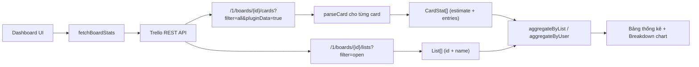
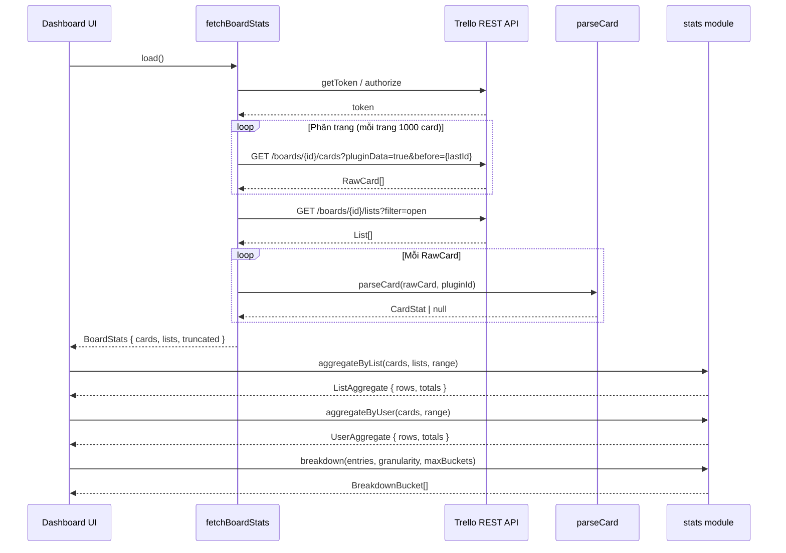
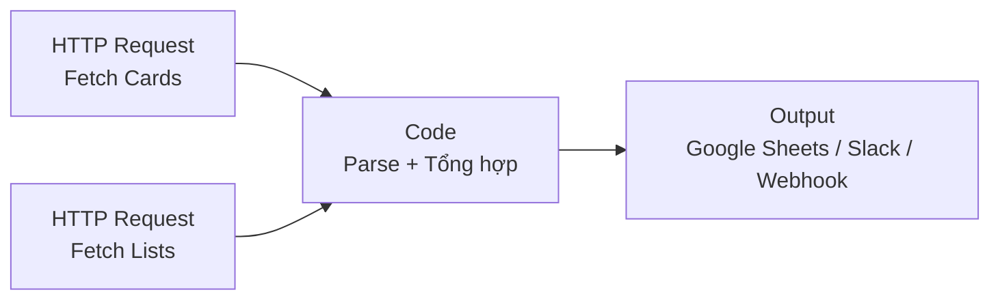

# Hướng dẫn lấy toàn bộ thông tin mục tiêu và logtime trên board

Tài liệu này giải thích cách hệ thống Point System lấy dữ liệu target (estimate) và logtime của mọi card trên board Trello, phục vụ dashboard tổng hợp.

## 1. Tổng quan kiến trúc



**Lõi**: Một request REST API duy nhất lấy đủ mọi card (kể cả archive) kèm pluginData. Không cần cache, không cần gọi từng card.

## 2. Cấu trúc dữ liệu pluginData

Mỗi card có `pluginData` lưu dưới scope `card/shared`. Cấu trúc JSON:

```json
{
  "est": 8,
  "log_5f1a2b3c4d5e6f7a8b9c0d1e": {
    "v": 1,
    "n": "Nguyễn Văn A",
    "u": "nguyenvana",
    "e": [
      ["2026-06-10", 2, "Làm phần header"],
      ["2026-06-11", 3, "Fix bug responsive"]
    ]
  },
  "log_6a7b8c9d0e1f2a3b4c5d6e7f": {
    "v": 1,
    "n": "Trần Thị B",
    "u": "tranthib",
    "e": [
      ["2026-06-10", 1.5, "Review code"]
    ]
  }
}
```

| Field | Ý nghĩa |
|-------|---------|
| `est` | Estimate (mục tiêu) của card, đơn vị point. `null` nếu chưa đặt. |
| `log_<memberId>` | Log của từng member. Key là `log_` + Trello member ID. |
| `v` | Version schema (hiện tại = 1). |
| `n` | Tên đầy đủ member (làm tươi mỗi lần log). |
| `u` | Username Trello. |
| `e` | Mảng entry, mỗi entry là tuple `[date, point, comment]`. |

Toàn bộ object này bị giới hạn **4096 ký tự** (trần pluginData của Trello).

## 3. Quy trình fetch từng bước

### 3.1. Xác thực (authorize)

```typescript
// Lấy REST API client từ Power-Up iframe
const t = window.TrelloPowerUp.iframe({ appKey: APP_KEY, appName: APP_NAME });
const restApi = await t.getRestApi();

// Lấy token (đã cấp trước đó) hoặc yêu cầu user cấp mới
let token = await restApi.getToken();
if (!token) {
  token = await restApi.authorize({ scope: 'read', expiration: 'never' });
}
```

**Lưu ý quan trọng**: iframe phải truyền `appKey` và `appName` khi gọi `TrelloPowerUp.iframe()`. Thiếu sẽ lỗi `PostMessageIO:NotHandled`.

### 3.2. Bulk fetch toàn bộ card

```
GET https://api.trello.com/1/boards/{boardId}/cards
  ?filter=all          # lấy cả card archive
  &pluginData=true     # kèm pluginData inline
  &fields=id,idShort,name,idList,closed
  &limit=1000          # tối đa mỗi trang
  &key={appKey}
  &token={token}
```

Nếu board có hơn 1000 card, dùng **phân trang bằng param `before`**:

```typescript
// Trang tiếp: truyền id card cuối của trang trước
const url = `...&before=${lastCardId}`;
```

Hàm `collectAllRawCards` (file `src/trello/fetch-board.ts`) tự gom tất cả trang với guard 50 trang (tối đa 50,000 card).

### 3.3. Fetch danh sách list

```
GET https://api.trello.com/1/boards/{boardId}/lists
  ?filter=open
  &fields=id,name
  &key={appKey}
  &token={token}
```

Chỉ lấy list đang mở (không lấy list archive).

### 3.4. Parse từng card

File `src/trello/parse-card.ts` chuyển raw card thành `CardStat`:

```typescript
interface CardStat {
  id: string;
  idShort: number;       // số thứ tự card trên board
  name: string;          // tên card
  idList: string;        // thuộc list nào
  closed: boolean;       // true = đã archive
  estimate: number | null;  // mục tiêu (est)
  entries: LogEntry[];   // tất cả entry log, đã phẳng hóa
}

interface LogEntry {
  memberId: string;
  fullName: string;
  date: string;          // YYYY-MM-DD
  point: number;
}
```

Quy trình parse:
1. Tìm pluginData có `idPlugin` khớp Power-Up ID.
2. Parse JSON string ra object.
3. Lấy `est` làm estimate.
4. Lặp qua key bắt đầu bằng `log_`, decode mỗi member log bằng `decodeMemberLog`.
5. Phẳng hóa tất cả entry thành mảng `LogEntry[]`.

### 3.5. Tổng hợp thống kê

Hai chế độ tổng hợp:

**Theo List** (`aggregateByList`):
- Chỉ card visible (không archive).
- Nhóm theo `idList`, tính tổng estimate, tổng logged.
- Giữ thứ tự list như board trả về.

**Theo User** (`aggregateByUser`):
- Tất cả card (kể cả archive), vì đóng góp cá nhân là tích lũy.
- Nhóm theo `memberId`, tính số entry và tổng point.
- Sắp xếp giảm dần theo tổng logged.

Cả hai đều hỗ trợ **lọc theo thời gian**: all, today, week, month, year.

## 4. Ví dụ gọi trực tiếp bằng curl

Để test ngoài Power-Up (debug, export), dùng curl:

```bash
# Thay {boardId}, {appKey}, {token} bằng giá trị thực
BOARD_ID="your_board_id"
APP_KEY="c6d8ef6ad65e19803361bb5a53bd"
TOKEN="your_member_token"

# Lấy toàn bộ card + pluginData
curl -s "https://api.trello.com/1/boards/${BOARD_ID}/cards?filter=all&pluginData=true&fields=id,idShort,name,idList,closed&limit=1000&key=${APP_KEY}&token=${TOKEN}" | jq '.'

# Lấy danh sách list
curl -s "https://api.trello.com/1/boards/${BOARD_ID}/lists?filter=open&fields=id,name&key=${APP_KEY}&token=${TOKEN}" | jq '.'
```

**Cách lấy token**: Mở Trello, vào Power-Up admin, hoặc dùng OAuth flow tại:
```
https://trello.com/1/authorize?key={appKey}&name=PointSystem&scope=read&expiration=never&response_type=token
```

## 5. Sơ đồ luồng dữ liệu chi tiết



## 6. Bảng tham chiếu file

| File | Vai trò |
|------|---------|
| `src/config.ts` | Hằng số `APP_KEY`, `APP_NAME`, `PLUGIN_ID` |
| `src/trello/fetch-board.ts` | Bulk fetch card + list qua REST API, phân trang |
| `src/trello/parse-card.ts` | Parse raw card thành `CardStat` |
| `src/core/codec.ts` | Encode/decode `MemberLog` (compact format) |
| `src/core/types.ts` | Type `Entry`, `MemberLog`, `DecodedMemberLog` |
| `src/core/stats-types.ts` | Type `CardStat`, `LogEntry`, `ListStat`, `UserStat`, `BreakdownBucket` |
| `src/core/stats.ts` | Tổng hợp: `aggregateByList`, `aggregateByUser`, `breakdown`, `periodRange` |
| `src/core/totals.ts` | Hàm `sumEntries`, `roundTotal` |
| `src/ui/dashboard.ts` | UI dashboard, gọi fetch + render bảng + biểu đồ |
| `src/connector.ts` | Đăng ký Power-Up capabilities, mở dashboard modal |
| `src/trello/storage.ts` | Đọc/ghi pluginData từng card (dùng trong popup, không dùng trong dashboard) |

## 7. Fetch từ n8n

Trello node built-in của n8n không hỗ trợ param `pluginData`. Dùng **HTTP Request node** gọi REST API trực tiếp.

### 7.1. Tổng quan workflow



3 node: 2 HTTP Request chạy song song, 1 Code node tổng hợp.

### 7.2. Lấy token

Mở URL sau trong trình duyệt, bấm Allow, copy token:

```
https://trello.com/1/authorize?key=c6d8ef6ad65e19803361ce65bb5a53bd&name=PointSystem&scope=read&expiration=never&response_type=token
```

Lưu token vào n8n Credential (loại "Header Auth" hoặc biến môi trường). Token không hết hạn trừ khi user thu hồi.

### 7.3. Node "Fetch Cards" (HTTP Request)

| Field | Giá trị |
|-------|---------|
| Method | GET |
| URL | `https://api.trello.com/1/boards/{{BOARD_ID}}/cards` |

**Query Parameters:**

| Key | Value |
|-----|-------|
| `filter` | `all` |
| `pluginData` | `true` |
| `fields` | `id,idShort,name,idList,closed` |
| `limit` | `1000` |
| `key` | `c6d8ef6ad65e19803361ce65bb5a53bd` |
| `token` | `{{TOKEN}}` |

Response Options: chọn **Response Format = JSON**, bật **Full Response = off**.

### 7.4. Node "Fetch Lists" (HTTP Request)

| Field | Giá trị |
|-------|---------|
| Method | GET |
| URL | `https://api.trello.com/1/boards/{{BOARD_ID}}/lists` |

**Query Parameters:**

| Key | Value |
|-----|-------|
| `filter` | `open` |
| `fields` | `id,name` |
| `key` | `c6d8ef6ad65e19803361ce65bb5a53bd` |
| `token` | `{{TOKEN}}` |

### 7.5. Node "Parse + Tổng hợp" (Code)

```javascript
const PLUGIN_ID = '6a23bad42e5ee3322bb770c0';
const LOG_PREFIX = 'log_';

// Lấy data từ 2 node trước
const rawCards = $('Fetch Cards').all().map(i => i.json);
const lists = $('Fetch Lists').all().map(i => i.json);
const listNameById = Object.fromEntries(lists.map(l => [l.id, l.name]));

// Parse pluginData từng card
const cards = [];

for (const card of rawCards) {
  const pd = (card.pluginData || []).find(p => p.idPlugin === PLUGIN_ID);
  if (!pd) continue;

  let data;
  try { data = JSON.parse(pd.value); } catch { continue; }

  const estimate = typeof data.est === 'number' ? data.est : null;
  const entries = [];

  for (const [key, value] of Object.entries(data)) {
    if (!key.startsWith(LOG_PREFIX)) continue;
    const memberId = key.slice(LOG_PREFIX.length);
    if (!memberId || !value || !Array.isArray(value.e)) continue;

    for (const e of value.e) {
      if (!Array.isArray(e) || e.length < 3) continue;
      entries.push({
        memberId,
        fullName: value.n || '',
        username: value.u || '',
        date: e[0],
        point: e[1],
        comment: e[2],
      });
    }
  }

  cards.push({
    cardId: card.id,
    cardNumber: card.idShort,
    cardName: card.name,
    listName: listNameById[card.idList] || '(ẩn)',
    closed: card.closed,
    estimate,
    totalLogged: entries.reduce((s, e) => s + e.point, 0),
    entries,
  });
}

// Tổng hợp theo list (chỉ card visible)
const byList = {};
for (const c of cards) {
  if (c.closed) continue;
  const key = c.listName;
  if (!byList[key]) byList[key] = { cards: 0, estimate: 0, logged: 0 };
  byList[key].cards++;
  byList[key].estimate += c.estimate || 0;
  byList[key].logged += c.totalLogged;
}

// Tổng hợp theo user (tất cả card, kể cả archive)
const byUser = {};
for (const c of cards) {
  for (const e of c.entries) {
    if (!byUser[e.memberId]) {
      byUser[e.memberId] = { fullName: e.fullName, entries: 0, logged: 0 };
    }
    byUser[e.memberId].entries++;
    byUser[e.memberId].logged += e.point;
  }
}

return [{
  json: { totalCards: cards.length, byList, byUser, cards }
}];
```

### 7.6. Lọc theo thời gian (tuỳ chọn)

Thêm đoạn filter vào đầu Code node:

```javascript
// Lọc theo tháng
const filterMonth = '2026-06';

// Trong vòng lặp entry, thay điều kiện push:
if (e[0].startsWith(filterMonth)) {
  entries.push({ ... });
}

// Lọc theo khoảng ngày
const startDate = '2026-06-01';
const endDate = '2026-06-30';

if (e[0] >= startDate && e[0] <= endDate) {
  entries.push({ ... });
}
```

### 7.7. Xử lý board lớn (> 1000 card)

Nếu board có hơn 1000 card, thêm **Loop Over Items** node:

1. Fetch Cards lần đầu (không có `before`).
2. Kiểm tra response có đúng 1000 card không.
3. Nếu có, lấy `id` card cuối, fetch tiếp với `&before={{lastCardId}}`.
4. Lặp đến khi response < 1000.

Thực tế hầu hết board dưới 1000 card, không cần loop.

### 7.8. Đầu ra gợi ý

| Mục đích | Node nối sau |
|----------|-------------|
| Ghi vào Google Sheets | Google Sheets node, map từng card thành 1 dòng |
| Gửi báo cáo Slack | Slack node, format summary từ `byList`/`byUser` |
| Lưu database | Postgres/MySQL node |
| Webhook cho hệ thống khác | HTTP Request node (POST) |
| Chạy định kỳ | Thêm Schedule Trigger node (ví dụ mỗi sáng 8h) |

## 8. Lưu ý chung

1. **Một request lấy đủ**: Endpoint `/boards/{id}/cards?pluginData=true` trả mọi card kèm pluginData. KHÔNG dùng nested route `/lists?cards=all&pluginData=true` (không hoạt động).

2. **filter=all bao gồm archive**: Card archive vẫn trả về. Phân biệt bằng field `closed: true`. Dashboard loại archive khi tính theo list, giữ archive khi tính theo user.

3. **Giới hạn 4096 ký tự/card**: pluginData mỗi card tối đa 4096 ký tự. Đây là giới hạn của Trello, không thay đổi được.

4. **Rate limit**: Trello giới hạn 100 request/10 giây/token, 300 request/10 giây/key. Với bulk fetch 1 request cho 1000 card, hầu như không bao giờ chạm rate limit.

5. **Token scope**: Chỉ cần `scope=read`. Token cấp qua Power-Up REST API helper, lưu phía Trello (không cần backend riêng).

6. **Phân trang**: Nếu board > 1000 card, hệ thống tự phân trang bằng param `before` (ID card cuối trang trước). Guard 50 trang = tối đa 50,000 card.
