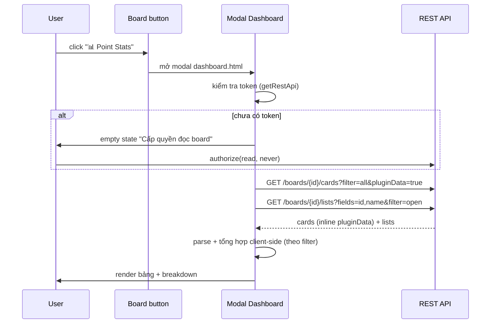

# Dashboard Thống Kê Point System — Thiết kế

Ngày: 2026-06-06
Trạng thái: Đã chốt qua brainstorming + grill, đã xác minh thực tế trên board. Chờ review spec.
Cập nhật 2026-06-17 (grill): tách rõ stock vs flow — tab List bỏ filter thời gian + breakdown (sửa bug progress `0/30`); filter chỉ thuộc tab User. Code + spec đã đồng bộ.

> Bản này thay thế thiết kế "sync thủ công + cache board-scope 8192" trước đó.
> Lý do đổi hướng: xác minh được REST API **bulk-fetch pluginData mọi card trong 1 request**
> (gồm cả card đã archive), nên cache trở thành thừa. Chi tiết ở mục 2.

## 1. Mục tiêu

Thêm **dashboard thống kê** ở cấp board, giải quyết 2 nhu cầu:

1. **Theo List**: tổng hợp tiến độ (estimate vs. logged) mỗi list, kèm thanh progress.
2. **Theo User**: tổng hợp point mỗi user đã log, breakdown theo ngày/tuần/tháng/năm.

Chỉ tab **Theo User** có **bộ lọc thời gian** (tất cả / hôm nay / tuần này / tháng này / năm này). Tab **Theo List** là ảnh chụp trạng thái (stock) nên **không** có bộ lọc — chi tiết và lý do ở mục 6.

Phi mục tiêu: export CSV, biểu đồ burndown/velocity, sync tự động (webhook), backend/store ngoài.

## 2. Ràng buộc kỹ thuật đã xác minh

### Trello Power-Up API không hỗ trợ inject UI vào list header

Không có capability `list-header-section`. Chỉ có `list-actions` (menu "..." của list) và `list-sorters`. Do đó dùng **board-button** mở modal.

### REST API BULK-FETCH được pluginData (điểm cốt lõi)

Giả định cũ "không thể bulk fetch pluginData" **chỉ đúng với client library** (`t.cards('all')` không trả pluginData). Với REST API thì khác:

```
GET /1/boards/{id}/cards?filter=all&pluginData=true
```

trả về **mọi card trong 1 request**, mỗi card kèm mảng `pluginData` inline. Đã verify thực tế trên board akachan (06/06/2026):

- 1 request lấy đủ 115 card (71 mở + 44 archive).
- Card có data trả đúng `value` = JSON string chứa `est` + `log_<memberId>`, khớp codec hiện tại.
- `filter=all` **giữ nguyên pluginData cho card đã archive**. `filter=visible` loại card archive.
- pluginData sống sót qua archive. Chỉ **xóa hẳn** card mới mất data.

Hệ quả: **không cần cache**. Mỗi lần mở dashboard fetch tươi rồi tổng hợp client-side.

### Rate limit KHÔNG còn là ràng buộc

100 request/10 giây mỗi token. Với bulk fetch, board ≤1000 card = 1 request, dưới 2 giây. Rate limit chỉ thành vấn đề nếu phải gọi từng card, mà ta không làm vậy nữa.

### Yêu cầu lấy cả card archive

Thống kê point theo user phải tính cả công trên card đã Done + archive, nếu không sẽ báo sai đóng góp. Vì vậy luôn fetch `filter=all`. Xem phạm vi per-tab ở mục 6.

## 3. Kiến trúc

Không còn lớp lưu trữ. Mở modal là fetch, tổng hợp trong RAM, render.



### Capability mới

| Capability | Mô tả |
|---|---|
| `board-buttons` | Nút "📊 Point Stats" trên thanh board |

Cần đăng ký thêm capability `board-buttons` tại `trello.com/power-ups/admin`.

### Cần appKey khi initialize

`TrelloPowerUp.initialize({...}, { appKey: '...', appName: '...' })` để dùng `t.getRestApi()`. appKey lấy từ Power-Up admin portal. Power-Up private nội bộ nên hardcode/biến môi trường đều chấp nhận được (appKey vốn lộ trong client JS, không phải bí mật).

## 4. Mô hình dữ liệu (chỉ trong RAM, KHÔNG persist)

Không lưu trữ gì. Đây là hình dạng dữ liệu sau khi parse response REST, sống trong phiên mở dashboard.

```typescript
// Một card sau khi parse từ REST. Không ghi đi đâu.
interface CardStat {
  id: string;
  idShort: number;
  name: string;
  idList: string;
  closed: boolean;          // tách phạm vi tab (mục 6)
  estimate: number | null;
  entries: LogEntry[];      // mọi entry của mọi member trên card
}

// Một lần log, đã phẳng hoá kèm member để tổng hợp.
interface LogEntry {
  memberId: string;
  fullName: string;         // từ field n trong log_<memberId>
  date: string;             // YYYY-MM-DD
  point: number;
}
```

Tổng hợp (theo list, theo user, breakdown) tính **on-the-fly** từ `CardStat[]` mỗi khi đổi tab hoặc đổi filter. Tái dùng codec parse hiện có (`decodeMemberLog`) cho phần `value`.

Không có trần dung lượng vì không ghi pluginData. Trần duy nhất là số card 1 request trả về (mục 11).

## 5. Luồng lấy dữ liệu

### Bước 1: Authorize (lazy, lần đầu mỗi người)

```typescript
const restApi = t.getRestApi();
const token = await restApi.getToken();
if (!token) {
  // KHÔNG popup ngay khi mở modal. Chỉ authorize khi user chủ động bấm "Tải thống kê".
  await restApi.authorize({ scope: 'read', expiration: 'never' });
}
```

Mỗi thành viên tự cấp token `read` của mình (không backend nên không có token dùng chung). Chấp nhận friction "mỗi người 1 lần".

### Bước 2: Bulk fetch cards + lists

```
GET /1/boards/{boardId}/cards?filter=all&pluginData=true&fields=id,idShort,name,idList,closed&card_fields=...
GET /1/boards/{boardId}/lists?fields=id,name&filter=open
```

`filter=all` để gồm card archive. `fields` gọn để giảm payload.

### Bước 3: Phân trang khi board lớn (fallback)

Nếu response trả về đúng ngưỡng cap (dấu hiệu còn card chưa lấy), phân trang:

```
...&limit=1000&before={idCardCuốiCùng}
```

lặp tới khi trả về < 1000 card. Mỗi trang 1 request, vẫn dưới rate limit.

### Bước 4: Guard cảnh báo

Nếu nghi ngờ thiếu card (chạm cap mà không phân trang được, hoặc lỗi giữa chừng), hiện cảnh báo **thay vì âm thầm sai số**: "Board quá lớn, thống kê có thể chưa đủ card".

### Bước 5: Parse và tổng hợp

Với mỗi card:
1. Lấy phần tử `pluginData` có `idPlugin` khớp Power-Up ID.
2. Parse `value` (JSON), lấy `est` và các key `log_*`.
3. Decode mỗi `log_*` (tái dùng `decodeMemberLog`) thành entries, phẳng hoá kèm `memberId` + `fullName` → `LogEntry[]`.
4. Gói thành `CardStat` kèm `closed`, `idList`.

Tổng hợp tính client-side: tab User áp filter thời gian + breakdown; tab List **tích lũy toàn thời gian**, không filter, không breakdown.

## 6. Phạm vi card theo tab

Fetch 1 lần `filter=all`, rồi tách phạm vi phía client bằng cờ `closed`:

| Tab | Phạm vi card | Lý do |
|---|---|---|
| Theo User | **Tất cả** (mở + archive) | Đóng góp tích lũy, phải đủ. Công trên card đã archive vẫn là công của user. |
| Theo List | **Chỉ visible** (`closed === false`) | Ảnh chụp tiến độ board hiện tại. Lọc visible cũng né vấn đề card archive mồ côi list (card visible luôn nằm trên list `filter=open`). |

Lưu ý ngữ nghĩa tab List: nếu team archive card sau khi Done, point trên card đó không hiện ở tab List. Tab List là "công việc đang mở", không phải "tổng tiến độ". Tab List hiển thị **số thực tế** của card visible, nhãn trung thực, không xử lý đặc biệt theo quy trình.

### Stock vs Flow — vì sao tab List KHÔNG có filter thời gian

Hai tab có **bản chất thời gian khác nhau**, đây là lõi chi phối toàn bộ thiết kế hiển thị:

| | Tab List | Tab User |
|---|---|---|
| Bản chất | **Stock** — trạng thái tích lũy ("còn bao nhiêu việc") | **Flow** — hoạt động theo kỳ ("kỳ này log bao nhiêu") |
| Chiều thời gian | Không (luôn là "bây giờ") | Có (cắt lát theo kỳ) |
| Filter thời gian | **Không áp** | **Có** |
| Breakdown | **Không** | Có (tuần/tháng) |
| Cột Log | Tích lũy toàn thời gian | Σ point trong kỳ đã lọc |

Lý do then chốt: progress bar tab List = `Log / Est`. `Est` không gắn ngày nên không filter được. Nếu filter chỉ cắt tử số `Log` mà mẫu số `Est` giữ nguyên, một card đã log đủ `30/30` từ tuần trước sẽ hiện `0/30 = 0%` khi chọn "Tuần này" — **số liệu sai lệch**. Vì vậy tab List bỏ filter hoàn toàn; tử số và mẫu số cùng trục thời gian (toàn bộ).

Hệ quả gắn nhãn: "Tổng Log" tab List (chỉ card visible) sẽ **nhỏ hơn** "Tổng Log" tab User filter=all (gồm archive). Đây là đúng và có chủ đích — mỗi tab kèm một caption trung thực (xem mục 7).

## 7. Giao diện

### Board button

- Icon: `📊` (hoặc SVG tương tự)
- Text: `Point Stats`
- Condition: `edit` (chỉ member có quyền edit board mới thấy)
- Click: mở modal `dashboard.html`, fullscreen: false, height: 600

### Dashboard modal

```
┌──────────────────────────────────────────────────────┐
│  📊 Point Stats Dashboard          [🔄 Làm mới] ⏱14:05│
│                                                      │
│  [Theo List]  [Theo User]                            │
│  Filter: [Tất cả] [Tuần] [Tháng] [Năm]  ← chỉ tab User│
│  « Ảnh chụp tiến độ hiện tại — chỉ card đang mở »     │
│                                                      │
│ ┌──────────────────────────────────────────────────┐ │
│ │ List          Cards   Est   Log   Tiến độ        │ │
│ │ ─────────────────────────────────────────────     │ │
│ │ To Do           5      20    0    ░░░░░░░░  0%   │ │
│ │ In Progress     3      15    8    ▓▓▓▓░░░░ 53%   │ │
│ │ Done            8      30   30    ▓▓▓▓▓▓▓▓ 100%  │ │
│ │ ─────────────────────────────────────────────     │ │
│ │ TỔNG           16      65   38    ▓▓▓▓▓░░░ 58%   │ │
│ └──────────────────────────────────────────────────┘ │
│                                                      │
│  ── Breakdown theo tuần ──                           │
│  W22: ████████ 12                                    │
│  W23: ████████████ 18                                │
│  W24: █████ 8                                        │
│                                                      │
└──────────────────────────────────────────────────────┘
```

### Tab "Theo List" (chỉ card visible, KHÔNG filter, KHÔNG breakdown)

Caption dưới tab: *"Ảnh chụp tiến độ hiện tại — chỉ card đang mở."*

| Cột | Nội dung |
|---|---|
| List | Tên list |
| Cards | Số card có point data trong list |
| Est | Σ estimate các card (null tính là 0) |
| Log | Σ logged **tích lũy toàn thời gian** (không filter — đây là stock) |
| Tiến độ | thanh progress bar + phần trăm = Log/Est. Nếu không có estimate → hiện "—" |

Dòng **TỔNG** cố định ở cuối bảng.

Tab List **không có breakdown** và **không chịu bộ lọc thời gian**: nó là ảnh chụp trạng thái hiện tại, không có chiều thời gian quá khứ. Mọi phân tích theo kỳ (flow) nằm ở tab User. (Lý do đầy đủ ở mục 6 — stock vs flow.)

### Tab "Theo User" (tất cả card, gồm archive)

Caption dưới tab: *"Toàn bộ công đã log, gồm card đã archive."* Đây là tab duy nhất có bộ lọc thời gian + breakdown.

```
┌──────────────────────────────────────────────────┐
│ User           Entries   Tổng Log                 │
│ ────────────────────────────────────────────      │
│ Tuấn              12       24.5                   │
│ Mai                8       15.0                   │
│ Khoa               3        6.0                   │
│ ────────────────────────────────────────────      │
│ TỔNG              23       45.5                   │
└──────────────────────────────────────────────────┘

── Breakdown theo tuần ──
      Tuấn   Mai   Khoa
W22:  ████   ██    █
W23:  ██████ ████  ██
W24:  ███    ██    
```

| Cột | Nội dung |
|---|---|
| User | fullName |
| Entries | Số lần log (filter theo thời gian) |
| Tổng Log | Σ point (filter theo thời gian) |

Dòng **TỔNG** cố định ở cuối.

Breakdown theo tuần: grouped bar (text-based), mỗi user một màu/pattern. Hiện 4-8 tuần gần nhất.

### Bộ lọc thời gian (chỉ tab User)

Bộ lọc nằm dưới thanh tab, chỉ hiện khi ở tab User. Sang tab List thì ẩn — tab List là stock, không có chiều thời gian (mục 6).

| Giá trị | Ý nghĩa |
|---|---|
| Tất cả | Không filter, hiện mọi dữ liệu |
| Hôm nay | entries.date = today (local browser) |
| Tuần này | Thứ 2 → Chủ nhật tuần hiện tại |
| Tháng này | Ngày 1 → cuối tháng hiện tại |
| Năm này | 1/1 → 31/12 năm hiện tại |

Filter áp dụng lên `LogEntry.date` của tab User, xử lý client-side. Breakdown tự động điều chỉnh granularity: "Hôm nay" → chỉ hiện tổng. "Năm này" → breakdown theo tháng.

### Nút Làm mới

- Text: "🔄 Làm mới" (fetch lại trong phiên, không cần đóng modal)
- Bên cạnh: "⏱ 14:05" (giờ fetch của lần tải hiện tại trong phiên)
- Khi đang tải: "Đang tải..." (+ progress nếu phải phân trang nhiều trang)
- Tải xong: cập nhật data + refresh bảng + cập nhật timestamp

### Trạng thái rỗng / lỗi

| Trạng thái | Hiển thị |
|---|---|
| Chưa cấp quyền | "Cấp quyền đọc board để xem thống kê" + nút Authorize (onboarding, không phải lỗi) |
| Không có card nào có point | "Board chưa có card nào có point data" |
| Fetch thất bại | Banner đỏ: "Lỗi khi tải: \{message\}. Thử lại?" |
| Token bị thu hồi (401) | Xoá token cũ, mời authorize lại |
| Board quá lớn (chạm cap) | Cảnh báo: "Board quá lớn, thống kê có thể chưa đủ card" |

## 8. File mới và file sửa

### File mới

| File | Mô tả |
|---|---|
| `dashboard.html` | HTML cho modal dashboard |
| `src/ui/dashboard.ts` | Logic UI dashboard (tabs, filter, render bảng, authorize lazy) |
| `src/ui/dashboard.css` | Style cho dashboard |
| `src/core/stats.ts` | Logic tổng hợp: filter thời gian, tổng theo list/user, breakdown tuần/tháng, tách phạm vi per-tab |
| `src/core/stats-types.ts` | Types `CardStat`, `LogEntry`, kết quả tổng hợp |
| `src/trello/fetch-board.ts` | Bulk fetch: authorize, GET cards `filter=all&pluginData=true`, phân trang, parse → `CardStat[]` |
| `tests/stats.test.ts` | Unit test cho stats.ts |

### File sửa

| File | Thay đổi |
|---|---|
| `src/connector.ts` | Thêm capability `board-buttons`, thêm appKey/appName vào initialize |
| `src/trello/trello-types.ts` | Thêm type cho `getRestApi()`, `modal()` |
| `src/trello/global.d.ts` | Cập nhật PowerUp interface cho board-buttons |
| `vite.config.ts` | Thêm `dashboard.html` vào multi-page build |

## 9. Chiến lược kiểm thử

### Vitest cho lõi thuần

- `stats.ts`: filter thời gian (ngày/tuần/tháng/năm), tổng theo list, tổng theo user, breakdown tuần/tháng, tách phạm vi per-tab (visible vs all), edge case (card không estimate, list rỗng, member rời board, card archive).

### Test thủ công trên board thật

- Board-button hiện đúng, click mở modal.
- Authorize lần đầu (empty state → popup → fetch).
- Fetch: 1 request, parse đúng, render đúng.
- Tab User gồm card archive; tab List chỉ visible.
- Filter thay đổi data, breakdown đúng.
- Edge: board rỗng, board 1 card, board nhiều card + nhiều archive.

## 10. Quyết định thiết kế đã chốt

| Câu hỏi | Quyết định | Lý do |
|---|---|---|
| Hiển thị ở đâu? | Board-button mở modal | API không hỗ trợ inject list header |
| Lấy data cách nào? | Bulk fetch REST `filter=all&pluginData=true`, fetch tươi mỗi lần | 1 request, đã verify gồm cả archive. Cache thành thừa. |
| Có cache không? | **Không**. Tổng hợp trong RAM | Fetch rẻ tới mức cache vô nghĩa. Né luôn trần 8192. |
| Board lớn? | Phân trang `before`/`limit` + guard cảnh báo. Không store ngoài | YAGNI backend. Fetch vài trăm card <3s. |
| Phạm vi card mỗi tab? | User=tất cả, List=chỉ visible | User cần tích lũy; List là ảnh chụp WIP, né list mồ côi |
| Filter thời gian áp tab nào? | **Chỉ tab User** (flow). Tab List là stock: Log tích lũy, không filter, không breakdown | Tab List = trạng thái hiện tại; trộn filter làm progress = Log/Est sai lệch (card `30/30` hiện `0%` khi lọc "tuần này") |
| Authorize? | Per-user, lazy, scope read, expiration never | Không backend nên mỗi người tự cấp; lazy tránh popup dội |

## 11. Mục gác lại (xử lý lúc implement)

1. **Phân trang cap:** verify cap chính xác của `/boards/{id}/cards?filter=all` lúc code (akachan mới 115 card, chưa test tới ngưỡng). Pattern `limit=1000` + `before` chạy đúng dù cap là bao nhiêu (miễn ≤1000).
2. **Timezone:** filter "hôm nay/tuần này" tính theo giờ local người xem. Team đa múi giờ có thể lệch ranh giới nửa đêm. Edge nhỏ, ghi nhận.
3. **Lỗi popup "Không tải được dữ liệu card":** quan sát thấy trong phiên grill, có vẻ transient (ghi/đọc card chạy lại bình thường sau khi thêm data test). Bug riêng của popup hiện tại, không thuộc dashboard. Điều tra `src/ui/popup.ts` (init, lines 305-331) nếu tái diễn.
